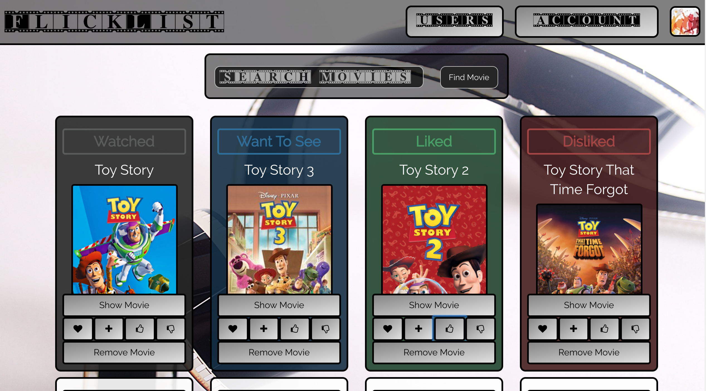
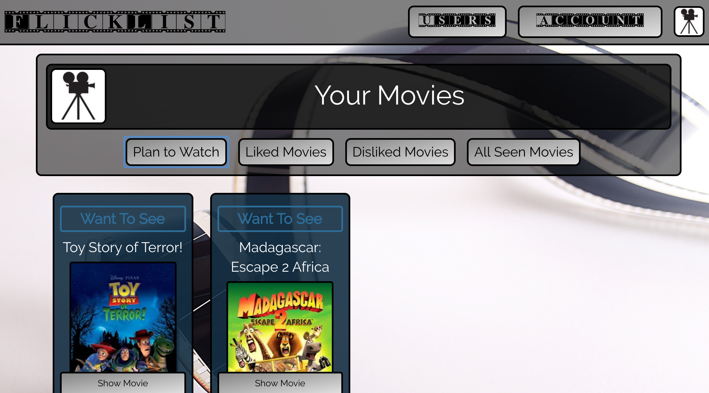

# FlickList

## Overview

[FlickList](https://flicklist.herokuapp.com) is a web app made over the course of 2 weeks for organizing movies into those you plan to see and those you have already seen. On the site, users can query The Movie Database API for movies and then add them to movie lists on their profile. Movie list options include "Plan to See", "Already Seen", "Liked", and "Disliked". The site also gives you the ability to view movie lists of other users, and has a recommendation feature that will suggest movies based on the movies you've liked.

###Author: [Yonatan Meschede-Krasa](https://github.com/yonatanmk)

##Features

* User authentication pages built using devise

* Google reCAPTCHA user verification 

* Movie search page queries THe Movie Database API to display a list of movies based on user search

* Movies can be marked as "Plan to See", "Already Seen", "Liked", or "Disliked"

* Interactive show page for movies that display movie cast, director, poster image, and release date

* Navigating to user profile page will display movie lists organized by how the users has labeled their movies

* Responsive user search modal that will display links to user profiles

* Users can view the profiles of other users and the movie lists they've created

* Movie suggestion feature using tastekid API to recommend movies to user based on the movies they've "liked"

##Core Technologies

###Stack

* PostgreSQL
* ActiveRecord
* Ruby on Rails
* React.js/Redux
* Foundation

###Testing

* RSpec
* Capybara
* Coveralls
* Codeship
* CodeClimate
* FactoryGirl
* DatabaseCleaner

###Gems

* Devise
* Simple Form
* CarrierWave
* Fog
* ReCaptcha
* FontAwesome

###Node Packages

* Lodash
* React
* React-DOM
* React-Redux
* Redux-Thunk
* React-Router
* React-Notify-Toast

###APIs

* The Movie Database API
* TasteKid API
